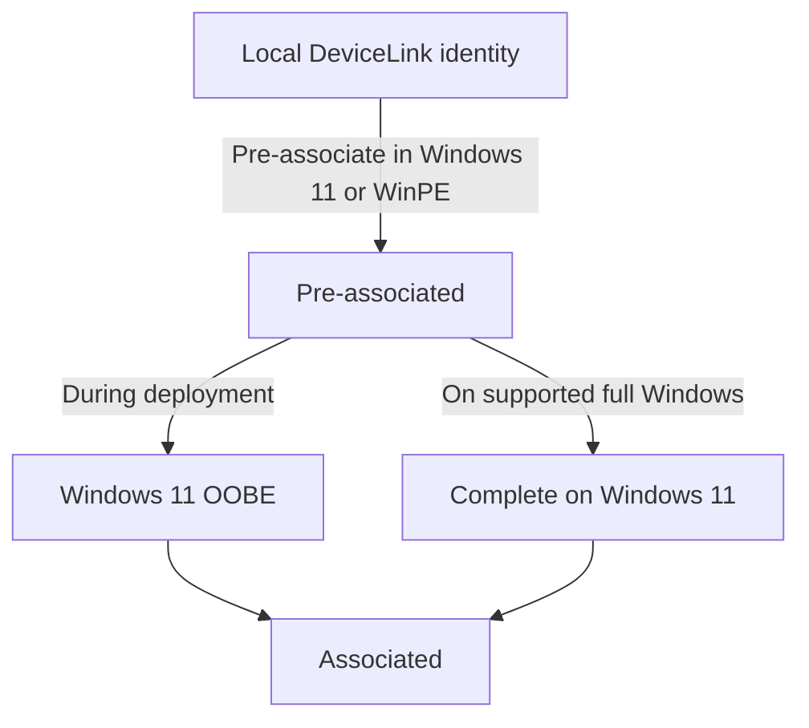
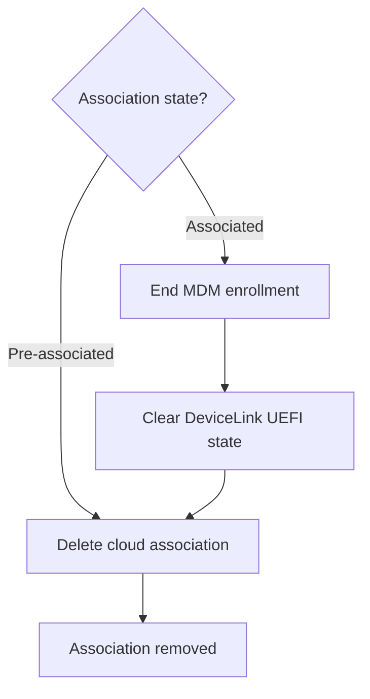
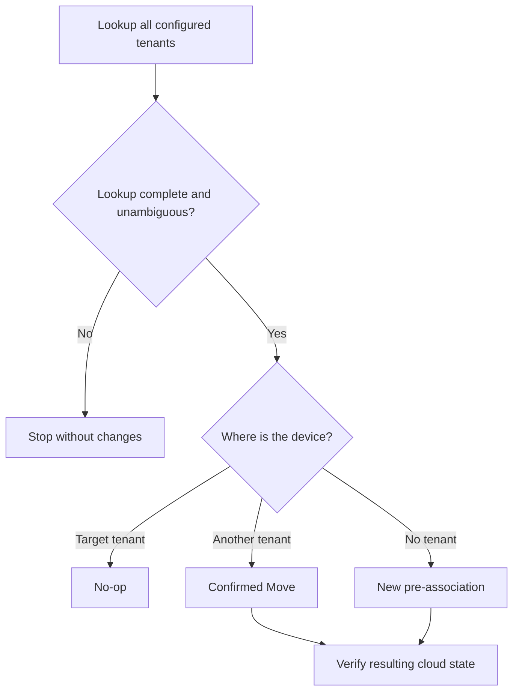

# WindowsDeviceLink

[](https://www.powershellgallery.com/packages/WindowsDeviceLink)
[](https://www.powershellgallery.com/packages/WindowsDeviceLink)
[](LICENSE)

**Prepare Windows devices for Windows Autopilot device preparation — from PowerShell or an optional GUI.**

WindowsDeviceLink is an open-source PowerShell module for **Device Association**. Pre-associate a physical device with an Intune tenant before OOBE, inspect its local and cloud state, and manage association, recovery and offboarding. Use it on supported Windows 11 devices or prepare devices from AMD64 Windows PE.

[Get started](#quick-start) · [Choose Direct or Backend](#choose-a-mode) · [Lifecycle](#device-association-lifecycle) · [FAQ](docs/FAQ.md)

## Why use WindowsDeviceLink?

- **Prepare devices before Windows deployment.** Generate the DeviceLink identity and pre-associate from Windows 11 or compatible WinPE; Windows can complete association during OOBE.
- **Use the interface that fits the job.** Run PowerShell cmdlets from the console, integrate them into deployment scripts, or use the operator GUI.
- **Work with one or multiple tenants.** Both Direct and Backend support multiple tenants. Direct uses operator sign-in for the selected tenant; Backend is recommended for multitenant management, with lookup across configured tenants, unattended assignment and controlled tenant moves.
- **See what is happening.** Inspect local firmware and tenant-side state, run diagnostics, export the official DeviceLink CSV and follow a documented offboarding flow.
- **Transition from classic Autopilot.** With Device Association, the existing Autopilot v1 registration can remain while the next OOBE deployment uses device preparation. [How this works](#moving-from-autopilot-v1).

> [!IMPORTANT]
> **Preview software — `0.12.0-preview1`.** Releases are unsigned. Native DeviceLink operations use undocumented Windows Runtime interfaces and cloud operations use Microsoft Graph beta APIs. Validate your intended workflow before wider deployment. See [support boundaries](#scope) and [testing status](TESTING.md).

## Quick start

On a supported **physical Windows 11 device**, open **native 64-bit Windows PowerShell 5.1 as administrator**. On ARM64, use native ARM64 PowerShell. See [requirements](#requirements) or the separate [WinPE setup](#windows-pe-workflow).

```powershell
Install-Module WindowsDeviceLink -Repository PSGallery -AllowPrerelease -Force
Import-Module WindowsDeviceLink
Test-WindowsDeviceLinkSupport
```

Continue with a supported device. Direct cloud operations require delegated Microsoft Graph permission `DeviceManagementServiceConfig.ReadWrite.All` and an operator with sufficient rights. See [authentication setup](docs/APP-REGISTRATION.md).

### PowerShell CLI

Pre-associate the device with the tenant used for sign-in, then inspect its status:

```powershell
Set-WindowsDeviceLinkTenant -Method Interactive

Get-WindowsDeviceLinkStatus -Online -Method Interactive |
    Format-List
```

A tenant ID is optional: the sign-in context selects the tenant. Direct mode also supports working with multiple tenants: supply `-TenantId '<tenant-id>'` to select the target for each CLI operation and authenticate with sufficient rights in that tenant. Each operation checks only its selected tenant. Pre-association creates the tenant-side record; it does not enroll Windows or install apps.

<details>
<summary>View a PowerShell CLI status example</summary>


*Example status lookup on Windows 11 (ARM64). This particular lookup found no association in the queried tenant (`NotAssociated`); it is not an example of a completed pre-association. Identifying details have been replaced with example values.*

</details>

### Optional GUI

```powershell
Show-WindowsDeviceLink
```

**Pre-associate is available in both Windows 11 and compatible AMD64 Windows PE, through the CLI and GUI.** Windows 11 defaults to `Interactive` sign-in; Windows PE defaults to `DeviceCode`. Backend mode is available in both environments when configured.

The **Associate** action completes the local device-side association and is available only on supported full Windows 11. In WinPE, pre-associate the device, install Windows 11, and let Windows complete association during OOBE. The GUI also provides status, CSV export, diagnostics and offboarding actions.


*The same operator interface shown in optional Backend mode on Windows 11 (ARM64), with example identifiers. The plain command above opens Direct mode. See the [GUI guide](docs/GUI.md) for both modes and tenant selection.*

## Choose a mode

**Both Direct and Backend support multiple tenants, through the CLI and GUI.** Backend is the recommended mode for ongoing multitenant management.

| | Direct | Backend |
|---|---|---|
| Connects to | Microsoft Graph | Your Azure Function backend |
| Authentication | Operator sign-in: Interactive or DeviceCode | Function API credential; Graph app credentials stay in Azure |
| Tenant support | One or multiple tenants; select a target for each operation | One or multiple tenants; centrally managed catalog |
| Cloud lookup | Selected tenant only | All configured tenants |
| Best fit | Interactive work across known tenants without a backend | Recommended for multitenant management, unattended assignment and verified tenant moves |
| Azure backend required | No | Yes |

For a **Direct-mode tenant selector in the GUI**, load a configuration containing multiple tenants:

```powershell
Show-WindowsDeviceLink -Configuration 'E:\Config\devicelink.json'
```

Select a tenant and sign in with an account that has sufficient rights there. Sign out before selecting another tenant. Configuration can be a local JSON file, HTTPS URL or inline JSON; see [multiple-tenant configuration examples](docs/CONFIGURATION.md#multiple-tenants-and-app-registrations). Direct checks the selected tenant; Backend adds lookup across all configured tenants and verified tenant moves.

For **unattended execution**, use the Backend CLI with an explicit target tenant and a securely supplied API key. Interactive and DeviceCode sign-in require a user. A backend failure does not silently fall back to Direct mode.

<details>
<summary>Backend CLI and GUI examples</summary>

For an interactive test, collect the API key securely:

```powershell
$apiKey = Read-Host 'WindowsDeviceLink API key' -AsSecureString
```

Assign the current device to a target tenant:

```powershell
Set-WindowsDeviceLinkTenant `
    -BackendUri 'https://<app>.azurewebsites.net/api/devicelink' `
    -BackendApiKey $apiKey `
    -TargetTenantId '<tenant-id>'
```

Or open the GUI with the backend tenant selector:

```powershell
Show-WindowsDeviceLink `
    -BackendUri 'https://<app>.azurewebsites.net/api/devicelink' `
    -BackendApiKey $apiKey
```

For unattended scripts, obtain `$apiKey` from your controlled credential-delivery mechanism instead of `Read-Host`. Do not embed API keys in WinPE images. The backend supports New, no-op and guarded Move decisions; tenant moves do not unenroll an existing Windows deployment.

</details>

See [tenant assignment modes](docs/TENANT-ASSIGNMENT-MODES.md), [backend setup](docs/AZURE-BACKEND.md) and [API security](docs/AUTHENTICATION-SECURITY.md).

## Device Association lifecycle

### Onboarding: pre-associate, then complete association

**Windows 11 and compatible AMD64 WinPE can both create the tenant-side pre-association.** Windows then completes device-side association, normally during OOBE. WindowsDeviceLink can also request completion explicitly on supported full Windows 11.



**Associated means the device has established its tenant binding, stored in UEFI. It does not mean Intune enrollment, app installation or device configuration is finished.**

- **WinPE:** pre-associate, install Windows 11, and let Windows complete association during OOBE.
- **Full Windows 11:** use **Associate** in the GUI or `Complete-WindowsDeviceLinkAssociation` after checking `Test-WindowsDeviceLinkPreflight`.
- A Windows reset or reinstall can retain an existing association; it is not an offboarding operation.

### Offboarding

Offboarding is a separate operation when the device leaves the tenant.

| Starting state | Required cleanup |
|---|---|
| Pre-associated; device-side association has not completed | Delete the tenant-side Device Association record. |
| Associated; tenant affinity is stored in UEFI | End MDM enrollment, clear the local DeviceLink UEFI state, then delete the tenant-side Device Association record. |

Deleting the cloud record alone does not remove an associated device's local tenant affinity. These actions also do not delete a classic Autopilot v1 registration.

<details>
<summary>View the offboarding flowchart</summary>



The local base identity can still exist or be generated again; the goal is to remove the old tenant association. MDM enrollment, Entra device records and classic Autopilot registration have their own lifecycle.

</details>

Use the [offboarding guide](docs/OFFBOARDING.md) for the complete procedure. Microsoft documents [association persistence](https://learn.microsoft.com/en-us/autopilot/device-preparation/device-association/lifecycle-management) and [state-dependent removal](https://learn.microsoft.com/en-us/autopilot/device-preparation/device-association/remove-association).

## Windows PE workflow

Use WinPE to prepare a device **before Windows installation**:

1. Supply a compatible `Windows.Management.Service.dll` using the project's **Bring Your Own DLL (BYO-DLL)** path.
2. Generate/read the DeviceLink identity and pre-associate with the intended tenant.
3. Install Windows 11 and allow association to complete during OOBE with network access.

The validated WinPE route is **AMD64**. Native association completion is not supported in WinPE, and ARM64 WinPE is outside the current support scope. Full Windows 11 provides its own registered runtime; BYO-DLL is specific to the WinPE compatibility route.

WindowsDeviceLink does not download or redistribute Microsoft's DLL. For prerequisites, installation and the unsigned Gallery preview's possible `-SkipPublisherCheck` requirement, see [WinPE installation](docs/INSTALLATION.md#amd64-windows-pe) and [workflow details](docs/WINPE-WORKFLOW.md).

## Moving from Autopilot v1

A device can keep its classic Autopilot registration and also be pre-associated for device preparation. With Device Association, **device preparation takes precedence during the next OOBE deployment**. Removing the v1 object first is therefore not a prerequisite for that transition.

Assigning a device preparation policy alone does not provide this precedence: without Device Association, an existing classic registration takes priority.

See [the migration FAQ](docs/FAQ.md#do-i-need-to-delete-the-autopilot-v1-object-before-transitioning-to-device-preparation) and [Microsoft's lifecycle guidance](https://learn.microsoft.com/en-us/autopilot/device-preparation/device-association/lifecycle-management#pre-associating-a-device-that-is-registered-for-windows-autopilot).

## Requirements

| Environment | CLI | GUI | Pre-associate | Complete local association |
|---|---|---|---|---|
| Supported Windows 11 AMD64 | Yes | Yes | Yes | Yes |
| Supported Windows 11 ARM64 | Yes | Yes | Yes | Yes |
| Compatible Windows PE AMD64 | Yes | Yes | **Yes** | No — complete in Windows 11 |
| Windows PE ARM64 | Not supported | Not supported | Not supported | Not supported |

ARM64 Windows 11 requires native ARM64 PowerShell and the registered system runtime. AMD64 WinPE requires an administrator-supplied compatible runtime.

Use physical hardware with **TPM 2.0**, **UEFI** and **native 64-bit Windows PowerShell 5.1**. Cloud operations require network access and appropriate tenant permissions. Firmware access and explicit completion require elevation.

Run `Test-WindowsDeviceLinkSupport` on the device; run `Test-WindowsDeviceLinkPreflight` before explicit completion. See [installation and troubleshooting](docs/INSTALLATION.md) and [current Microsoft Device Association requirements](https://learn.microsoft.com/en-us/autopilot/device-preparation/device-association/requirements).

## Common operations

| Task | Command |
|---|---|
| Read the local identity | `Get-WindowsDeviceLink` |
| Export the official Windows-generated CSV | `Get-WindowsDeviceLink -OutputDirectory 'C:\DeviceLink'` |
| Inspect local state | `Get-WindowsDeviceLinkStatus` |
| Inspect local and cloud state | `Get-WindowsDeviceLinkStatus -Online -Method Interactive` |
| Pre-associate with the signed-in tenant | `Set-WindowsDeviceLinkTenant -Method Interactive` |
| Inspect the local tenant binding | `Get-WindowsDeviceLinkLocalAssociation` |
| Check readiness for explicit completion | `Test-WindowsDeviceLinkPreflight` |
| Open the operator GUI | `Show-WindowsDeviceLink` |

For state changes, recovery, removal and tenant moves, follow the [FAQ](docs/FAQ.md) and the relevant operation guide.

## Azure Function backend

The optional backend centralizes tenant lookup, pre-association and controlled tenant moves. Its configuration maps allowed tenants to certificate or client-secret authentication profiles; Graph credentials stay in Key Vault-backed Function App settings.

The current preview supports **manual Azure configuration and deployment of the supplied Function App package**. The experimental Bicep/ARM route is still tracked in [issue #43](https://github.com/roryvossepoel/WindowsDeviceLink/issues/43).

Start with [backend deployment](docs/AZURE-BACKEND.md), [backend configuration](docs/BACKEND-CONFIGURATION.md) and [multitenant consent](docs/MULTITENANT-CONSENT.md).

<details>
<summary>View the backend tenant-assignment flowchart</summary>



This shows the default assignment path. A tenant move renews the local identity and handles the proven source record before verifying the target. It does not unenroll Windows or remove existing Entra/Intune managed-device records. See [tenant assignment modes](docs/TENANT-ASSIGNMENT-MODES.md) for prerequisites and repair options.

</details>

## Public commands

<details>
<summary>View all exported cmdlets</summary>

| Command | Purpose |
|---|---|
| `Complete-WindowsDeviceLinkAssociation` | Guardedly complete a preassociated DeviceLink on the local device and verify the resulting firmware/JWT state. |
| `Connect-WindowsDeviceLink` | Delegated Microsoft Graph sign-in (Interactive or DeviceCode). |
| `Export-WindowsDeviceLinkCsv` | Export an existing DeviceLink object using the Windows CSV API. |
| `Get-WindowsDeviceLink` | Obtain the local DeviceLink identity; optionally export it. |
| `Get-WindowsDeviceLinkAssociation` | Query a tenant-side Intune Device Association by serial number or association ID. |
| `Get-WindowsDeviceLinkFirmwareState` | Read safe metadata and the validated firmware timestamp. |
| `Get-WindowsDeviceLinkLocalAssociation` | Correlate the current local DeviceLink identity with registry and Association JWT tenant hints without cloud access. |
| `Get-WindowsDeviceLinkRepairPlan` | Return a non-destructive repair recommendation for observed lifecycle state. |
| `Get-WindowsDeviceLinkStatus` | Combine runtime, local identity, firmware and optional tenant-side association diagnostics. |
| `Initialize-WindowsDeviceLink` | Safely initialize pre-association and optionally complete association with explicit `-Associate`. |
| `Get-WindowsDeviceLinkBackendTenant` | Read the authenticated Function backend tenant catalog. |
| `Set-WindowsDeviceLinkTenant` | Apply New/no-op in Direct mode, or New/no-op/verified Move in Backend mode. |
| `Register-WindowsDeviceLink` | Explicitly create a tenant-side pre-association directly or through a webhook. |
| `Remove-WindowsDeviceLinkAssociation` | Remove a tenant-side Device Association record. |
| `Reset-WindowsDeviceLinkFirmwareState` | Reset and immediately verify local DeviceLink UEFI identity state. |
| `Show-WindowsDeviceLink` | Open the Windows 11 / Windows PE operator GUI for status, tenant selection, onboarding, offboarding, CSV export and activity output. Native association remains disabled in Windows PE. |
| `Test-WindowsDeviceLinkAssociationJwt` | Validate local association JWT structure/time/identity correlation without exposing the raw JWT. |
| `Test-WindowsDeviceLinkDiscovery` | Perform read-only native DeviceLink association discovery. |
| `Test-WindowsDeviceLinkHealth` | Non-destructively classify status into machine-readable lifecycle/health states. |
| `Test-WindowsDeviceLinkPreflight` | Assess local runtime, firmware, TPM, Secure Boot and DeviceLink prerequisites. |
| `Test-WindowsDeviceLinkRuntime` | Validate an administrator-supplied runtime DLL without changing state. |
| `Test-WindowsDeviceLinkSupport` | Validate runtime, architecture and DeviceLink activation. |

</details>

## Documentation

| Start here | Guide |
|---|---|
| Install the module or troubleshoot runtime support | [Installation](docs/INSTALLATION.md) |
| Find the right command for a task | [FAQ and common operations](docs/FAQ.md) |
| Use the operator interface | [GUI guide](docs/GUI.md) |
| Prepare devices before Windows installation | [WinPE workflow](docs/WINPE-WORKFLOW.md) |
| Choose tenant scope and authentication | [Direct and Backend modes](docs/TENANT-ASSIGNMENT-MODES.md) |
| Configure a named tenant or tenant selector | [Configuration examples](docs/CONFIGURATION.md) |
| Remove an association correctly | [Offboarding](docs/OFFBOARDING.md) |
| Check validation and remaining test work | [Testing status](TESTING.md) |
| Follow the remaining polish and live-test work in order | [Current checklist](docs/VALIDATION-CHECKLIST.md) |

<details>
<summary>Browse all technical documentation</summary>

- [AUTOPILOT-V1-VS-DEVICE-PREPARATION.md](docs/AUTOPILOT-V1-VS-DEVICE-PREPARATION.md) — classic Windows Autopilot vs Windows Autopilot device preparation.
- [FAQ.md](docs/FAQ.md) — practical operations and lifecycle questions.
- [GUI.md](docs/GUI.md) — operator GUI, authentication, tenant selectors and Windows PE runtime usage.
- [INSTALLATION.md](docs/INSTALLATION.md) — Windows 11 / WinPE installation and troubleshooting.
- [WINPE-WORKFLOW.md](docs/WINPE-WORKFLOW.md) — supported WinPE workflow and native completion boundary.
- [ONLINE-METHODS.md](docs/ONLINE-METHODS.md) — cloud operations and authentication methods.
- [AZURE-BACKEND.md](docs/AZURE-BACKEND.md) — Azure Function backend architecture and deployment.
- [BACKEND-CONFIGURATION.md](docs/BACKEND-CONFIGURATION.md) — tenant and authentication-profile schema.
- [APP-REGISTRATION.md](docs/APP-REGISTRATION.md) — multitenant Entra App Registration and Graph permission.
- [MULTITENANT-CONSENT.md](docs/MULTITENANT-CONSENT.md) — onboarding target tenants with explicit admin consent.
- [MULTITENANT-LOOKUP.md](docs/MULTITENANT-LOOKUP.md) — search managed tenants by serial number.
- [RECONCILE-SCHEMA-v1.md](docs/RECONCILE-SCHEMA-v1.md) — safe multitenant New / Move / Update reconciliation.
- [SECURITY-HARDENING.md](docs/SECURITY-HARDENING.md) — reference-deployment security boundary and optional hardening.
- [FIRMWARE-STATE.md](docs/FIRMWARE-STATE.md) — UEFI state and reset lifecycle.
- [LOCAL-TENANT-DISCOVERY.md](docs/LOCAL-TENANT-DISCOVERY.md) — local source-tenant identification, trust levels and lifecycle.
- [DISCOVER-LINK-RESEARCH.md](docs/DISCOVER-LINK-RESEARCH.md) — validated DeviceLinkManager research/evidence.
- [OFFBOARDING.md](docs/OFFBOARDING.md) — complete pre-associated / associated offboarding flow.
- [REMOVE-ASSOCIATION.md](docs/REMOVE-ASSOCIATION.md) — tenant-side Device Association removal.
- [CODE-SIGNING.md](docs/CODE-SIGNING.md) — code-signing policy and release provenance.
- [PRIVACY.md](PRIVACY.md) — privacy policy and administrator-initiated network transfers.
- [TESTING.md](TESTING.md) — validation matrix and live-test evidence.

</details>

## Current version

The current preview release line is `0.12.0-preview1`. See [release notes](docs/releases/0.12.0-preview1.md).

## Scope

WindowsDeviceLink manages **Device Association**, including local identity, tenant-side records, diagnostics and guarded lifecycle operations. It does not assign device preparation policies or configure the apps and settings delivered by Intune.

ARM64 WinPE, direct ARM64 DLL activation, classic Autopilot v1 management, cryptographic association-JWT signature verification and production support guarantees are outside the current scope.

## Code signing

Preview packages are unsigned. WindowsDeviceLink does not redistribute or sign Microsoft's runtime DLL. See [code signing and provenance](docs/CODE-SIGNING.md).

## License

Project code is licensed under the MIT License. Microsoft binaries and services remain subject to Microsoft's terms.
