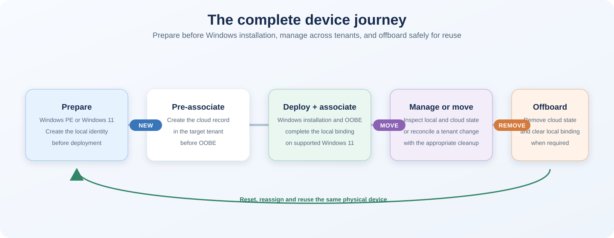
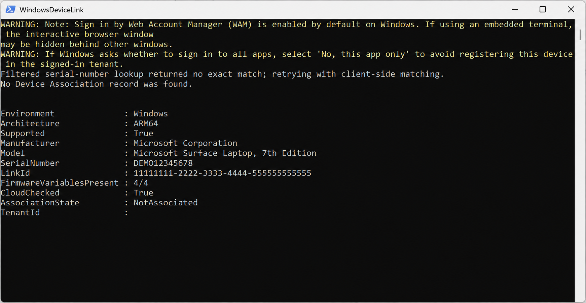
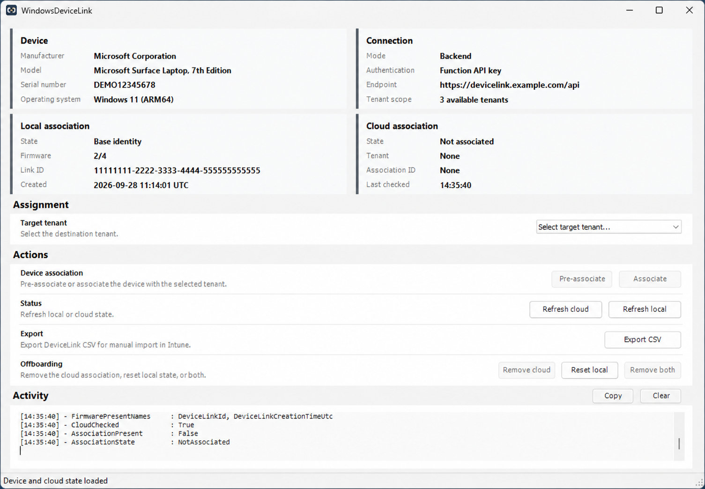
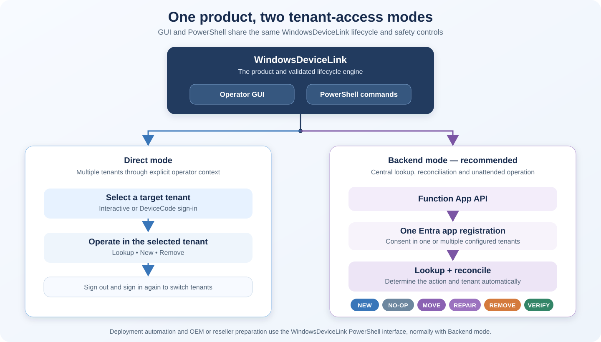

# WindowsDeviceLink

[](https://www.powershellgallery.com/packages/WindowsDeviceLink)
[%3D'VersionDownloadCount'%5D&label=downloads%20(latest)&color=blue&cacheSeconds=3600)](https://www.powershellgallery.com/packages/WindowsDeviceLink)
[](https://github.com/roryvossepoel/WindowsDeviceLink/actions/workflows/ci.yml)
[](#requirements)
[](#requirements)
[](LICENSE)

**The complete Device Association lifecycle for Windows Autopilot device preparation.**

WindowsDeviceLink is an open-source PowerShell module for onboarding physical devices
before Windows is installed, managing them across Intune tenants, and safely offboarding
them at the end of their journey. Generate the TPM-backed DeviceLink identity and
pre-associate the device from **AMD64 Windows PE (WinPE)**, then let Windows complete Device
Association during OOBE.

The native Windows 11 lifecycle has been validated on physical **AMD64 and ARM64**
hardware. Current **WinPE** validation is limited to AMD64; ARM64 WinPE has
not yet been validated and remains outside the supported scope.

Use the operator GUI for technician-led preparation, PowerShell for deployment
automation, Direct mode for delegated Microsoft Graph access, or the included
**Azure Function App API** for centralized multitenant, reseller and OEM-style
workflows. The Function App API is the recommended route for structured multitenant
and unattended use.

[Get started](#quick-start) · [Choose Direct or Backend](#choose-a-mode) · [Lifecycle](#lifecycle-and-deployment-paths) · [Windows PE](docs/WINPE-WORKFLOW.md) · [FAQ](docs/FAQ.md)



## One module for the complete device journey

- **Prepare before Windows deployment.** Generate the identity and create the tenant-side
  pre-association from AMD64 Windows PE with your own compatible
  `Windows.Management.Service.dll`.
- **Use a GUI or automate with PowerShell.** Support guided technician workflows and
  repeatable or unattended deployment automation with the same lifecycle operations.
- **Manage multiple tenants.** Direct mode works with one explicitly selected signed-in
  tenant at a time; Backend centrally searches and reconciles all consented tenants.
- **Integrate through the included Function App API.** Use authenticated endpoints for
  tenant discovery, pre-association, reconciliation, offboarding and verification while
  Microsoft Graph credentials remain off Windows and WinPE endpoints.
- **Cover the complete lifecycle.** Inspect, onboard, associate, move, offboard and reset
  devices for reuse or disposal.

The WinPE and Backend building blocks also provide a technical integration route for OEM
or reseller preparation. This is not an official Microsoft OEM registration channel.
Existing Autopilot v1 registrations can remain during a transition to Device Preparation;
[read how precedence works](#autopilot-v1-transition).

| Scenario | Operator GUI | PowerShell | Authentication | Environment |
|---|---:|---:|---|---|
| Technician-led pre-association | Yes | Yes | Interactive, DeviceCode or Backend | Windows 11 (AMD64/ARM64) and AMD64 WinPE |
| Automated pre-association | — | Yes | Backend API | Windows 11 (AMD64/ARM64) and AMD64 WinPE |
| API integration with tenant lookup and reconciliation | Via Backend | Yes | Function API key; app credentials stay in Azure | Any authorized HTTPS client |
| Complete local association | Yes | Yes | Direct or Backend | Supported full Windows 11 |
| Multiple tenants and controlled moves | Yes | Yes | Direct or Backend; Backend recommended | Windows 11 (AMD64/ARM64) and AMD64 WinPE |
| Diagnostics and official CSV export | Yes | Yes | Local where possible | Windows 11 (AMD64/ARM64) and AMD64 WinPE |
| Cloud removal and local reset | Yes | Yes | Depends on the selected operation | Supported full Windows 11 |

> [!NOTE]
> Certificate and client-secret authentication are used by the recommended Backend when it
> connects to Microsoft Graph. Direct mode uses delegated `Interactive` or `DeviceCode`
> authentication. The workstation or WinPE client authenticates to Backend mode with its
> API credential. The complete Function App implementation and API endpoints are included
> in this repository; see the [Azure Function backend](docs/AZURE-BACKEND.md).

> [!IMPORTANT]
> **Stable release line — source version `1.0.0`.** Releases are unsigned. Native DeviceLink operations use undocumented Windows Runtime interfaces and cloud operations use Microsoft Graph beta APIs. Validate your intended workflow before wider deployment. See [release and support status](#release-and-support-status) and [testing status](TESTING.md).

## Quick start

On a supported **physical Windows 11 device**, open **native 64-bit Windows PowerShell 5.1 as administrator**. On ARM64, use native ARM64 PowerShell. See [requirements](#requirements) or the separate [WinPE setup](docs/WINPE-WORKFLOW.md).

```powershell
Install-Module WindowsDeviceLink -Repository PSGallery -Force
Import-Module WindowsDeviceLink
Test-WindowsDeviceLinkSupport
```

Continue with a supported device. Direct cloud operations require delegated Microsoft Graph permission `DeviceManagementServiceConfig.ReadWrite.All` and an operator with sufficient rights. See [authentication setup](docs/APP-REGISTRATION.md).

### PowerShell CLI

Pre-associate the device with the tenant used for sign-in, then inspect its status:

```powershell
Set-WindowsDeviceLinkTenant -Method Interactive

Get-WindowsDeviceLinkStatus -Online -Method Interactive |
    Format-List
```

A tenant ID is optional: the sign-in context selects the tenant. Direct mode also supports working with multiple tenants: supply `-TenantId '<tenant-id>'` to select the target for each CLI operation and authenticate with sufficient rights in that tenant. Each operation checks only its selected tenant. Pre-association creates the tenant-side record; it does not enroll Windows or install apps.

<details>
<summary>View a PowerShell CLI status example</summary>



*Example status lookup on Windows 11 (ARM64). This particular lookup found no association in the queried tenant (`NotAssociated`); it is not an example of a completed pre-association. Identifying details have been replaced with example values.*

</details>

### Optional GUI

```powershell
Show-WindowsDeviceLink
```

**Pre-associate is available in both Windows 11 and compatible AMD64 Windows PE, through the CLI and GUI.** Windows 11 defaults to `Interactive` sign-in; Windows PE defaults to `DeviceCode`. Backend mode is available in both environments when configured.

The **Associate** action completes the local device-side association and is available only on supported full Windows 11. In WinPE, pre-associate the device, install Windows 11, and let Windows complete association during OOBE. The GUI also provides status, CSV export, diagnostics and offboarding actions.



*The same operator interface shown in optional Backend mode on Windows 11 (ARM64), with example identifiers. The plain command above opens Direct mode. See the [GUI guide](docs/GUI.md) for both modes and tenant selection.*

## Choose a mode

**Both Direct and Backend support multiple tenants, through the CLI and GUI.** Backend is the recommended mode for ongoing multitenant management.

| | Direct | Backend |
|---|---|---|
| Connects to | Microsoft Graph | Your Azure Function backend |
| Authentication | Operator sign-in: Interactive or DeviceCode | Function API credential; Graph app credentials stay in Azure |
| Tenant support | One or multiple tenants; one selected and signed-in tenant per operation | One or multiple tenants; centrally managed catalog |
| Tenant switching | Sign out, select another tenant and sign in again | No operator tenant switching |
| Cloud lookup | Selected tenant only | All configured tenants |
| Decision model | Operator selects the tenant and operation | Lookup and reconciliation determine the required action and tenant |
| Lifecycle actions | Lookup, New and Remove; a cross-tenant move is performed as separate source removal and target creation | Lookup, New, no change, Repair, verified Move, Remove and post-state verification |
| Best fit | Interactive work across known tenants without a backend | Recommended for multitenant management, unattended assignment and verified tenant moves |
| Azure backend required | No | Yes |



*Both the operator GUI and PowerShell commands support both modes. Direct operates against
one explicitly selected signed-in tenant at a time. Backend uses one Entra app registration
with consent in one or more configured tenants and performs lookup and reconciliation before
selecting New, no change, Repair, Move or Remove.*

For a **Direct-mode tenant selector in the GUI**, load a configuration containing multiple tenants:

```powershell
Show-WindowsDeviceLink -Configuration 'E:\Config\devicelink.json'
```

Select a tenant and sign in with an account that has sufficient rights there. Sign out before selecting another tenant. Configuration can be a local JSON file, HTTPS URL or inline JSON; see [multiple-tenant configuration examples](docs/CONFIGURATION.md#multiple-tenants-and-app-registrations). Direct checks only the selected tenant. Backend uses one Entra app registration with consent in one or more configured tenants, searches that catalog first and reconciles the required action and tenant.

For **unattended execution**, use the Backend CLI with an explicit target tenant and a securely supplied API key. Interactive and DeviceCode sign-in require a user. A backend failure does not silently fall back to Direct mode.

Start the Backend GUI with a securely supplied API key:

```powershell
$apiKey = Read-Host 'WindowsDeviceLink API key' -AsSecureString

Show-WindowsDeviceLink `
    -BackendUri 'https://<app>.azurewebsites.net/api/devicelink' `
    -BackendApiKey $apiKey
```

For unattended execution, retrieve the key through a controlled credential-delivery
mechanism instead of `Read-Host`; do not embed it in a WinPE image. See the
[GUI authentication examples](docs/GUI.md#launch-the-backend-gui-without-an-api-key-prompt)
and [Backend CLI guidance](docs/AZURE-BACKEND.md).

See [tenant assignment modes](docs/TENANT-ASSIGNMENT-MODES.md), [backend setup](docs/AZURE-BACKEND.md) and [API security](docs/AUTHENTICATION-SECURITY.md).

## Lifecycle and deployment paths

### Onboarding

Windows 11 and compatible AMD64 WinPE can both create the tenant-side
pre-association. In WinPE, bring your own compatible Microsoft runtime DLL,
pre-associate the device before Windows installation, then let Windows complete the
association during OOBE. On supported full Windows 11, the GUI or
`Complete-WindowsDeviceLinkAssociation` can also request completion explicitly.

An associated state means that the tenant binding is stored in UEFI. It does not mean
that Intune enrollment, application installation or device configuration is complete.
See the [WinPE workflow](docs/WINPE-WORKFLOW.md) and
[installation requirements](docs/INSTALLATION.md#amd64-windows-pe).

### Offboarding and reuse

Offboarding is a separate lifecycle operation when a device leaves a tenant.

| Starting state | Required cleanup |
|---|---|
| Pre-associated; device-side association has not completed | Delete the tenant-side Device Association record. |
| Associated; tenant affinity is stored in UEFI | End MDM enrollment, clear the local DeviceLink UEFI state, then delete the tenant-side Device Association record. |

Deleting only the cloud record does not remove local tenant affinity. MDM enrollment,
Entra device records and classic Autopilot registrations have their own lifecycle. Follow
the [offboarding guide](docs/OFFBOARDING.md) for the complete and state-dependent procedure.

### Autopilot v1 transition

A device can keep its classic Autopilot registration and also be pre-associated for device preparation. With Device Association, **device preparation takes precedence during the next OOBE deployment**. Removing the v1 object first is therefore not a prerequisite for that transition.

Assigning a device preparation policy alone does not provide this precedence: without Device Association, an existing classic registration takes priority.

See [the migration FAQ](docs/FAQ.md#do-i-need-to-delete-the-autopilot-v1-object-before-transitioning-to-device-preparation)
and [Microsoft's lifecycle guidance](https://learn.microsoft.com/en-us/autopilot/device-preparation/device-association/lifecycle-management#pre-associating-a-device-that-is-registered-for-windows-autopilot).

## Requirements

| Environment | CLI | GUI | Pre-associate | Complete local association |
|---|---|---|---|---|
| Supported Windows 11 AMD64 | Yes | Yes | Yes | Yes |
| Supported Windows 11 ARM64 | Yes | Yes | Yes | Yes |
| Compatible AMD64 WinPE | Yes | Yes | **Yes** | No — complete in Windows 11 |
| ARM64 WinPE | Not supported | Not supported | Not supported | Not supported |

ARM64 Windows 11 requires native ARM64 PowerShell and the registered system runtime. AMD64 WinPE requires an administrator-supplied compatible runtime.

Use physical hardware with **TPM 2.0**, **UEFI** and **native 64-bit Windows PowerShell 5.1**. Cloud operations require network access and appropriate tenant permissions. Firmware access and explicit completion require elevation.

Run `Test-WindowsDeviceLinkSupport` on the device; run `Test-WindowsDeviceLinkPreflight` before explicit completion. See [installation and troubleshooting](docs/INSTALLATION.md) and [current Microsoft Device Association requirements](https://learn.microsoft.com/en-us/autopilot/device-preparation/device-association/requirements).

## Common operations

| Task | Command |
|---|---|
| Read the local identity | `Get-WindowsDeviceLink` |
| Export the official Windows-generated CSV | `Get-WindowsDeviceLink -OutputDirectory 'C:\DeviceLink'` |
| Inspect local state | `Get-WindowsDeviceLinkStatus` |
| Inspect local and cloud state | `Get-WindowsDeviceLinkStatus -Online -Method Interactive` |
| Pre-associate with the signed-in tenant | `Set-WindowsDeviceLinkTenant -Method Interactive` |
| Inspect the local tenant binding | `Get-WindowsDeviceLinkLocalAssociation` |
| Check readiness for explicit completion | `Test-WindowsDeviceLinkPreflight` |
| Open the operator GUI | `Show-WindowsDeviceLink` |

For state changes, recovery, removal and tenant moves, follow the [FAQ](docs/FAQ.md) and the relevant operation guide.

## Azure Function backend

The included Azure Function backend is the **recommended route for structured
multitenant and unattended operations**. It centralizes tenant lookup, pre-association,
reconciliation, controlled moves, offboarding and verification while Graph credentials
remain in Azure. Direct mode remains available when centralized orchestration is not
required.

The supported backend route uses **manual Azure configuration and deployment of the supplied Function App package**. The experimental Bicep/ARM route is still tracked in [issue #43](https://github.com/roryvossepoel/WindowsDeviceLink/issues/43).

Start with [backend deployment](docs/AZURE-BACKEND.md),
[backend configuration](docs/BACKEND-CONFIGURATION.md) and
[multitenant consent](docs/MULTITENANT-CONSENT.md).

## Documentation

| Start here | Guide |
|---|---|
| Install the module or troubleshoot runtime support | [Installation](docs/INSTALLATION.md) |
| Find the right command for a task | [FAQ and common operations](docs/FAQ.md) |
| Use the operator interface | [GUI guide](docs/GUI.md) |
| Prepare devices before Windows installation | [WinPE workflow](docs/WINPE-WORKFLOW.md) |
| Choose tenant scope and authentication | [Direct and Backend modes](docs/TENANT-ASSIGNMENT-MODES.md) |
| Configure a named tenant or tenant selector | [Configuration examples](docs/CONFIGURATION.md) |
| Remove an association correctly | [Offboarding](docs/OFFBOARDING.md) |
| Browse exported cmdlets | [Command reference](docs/COMMANDS.md) |
| Browse all technical documentation | [Documentation index](docs/README.md) |

## Release and support status

The source tree targets stable `1.0.0`; see the
[release notes](docs/releases/1.0.0.md). Packages are currently unsigned, and
WindowsDeviceLink does not redistribute or sign Microsoft's runtime DLL. See
[code signing and provenance](docs/CODE-SIGNING.md).

WindowsDeviceLink manages **Device Association**, including local identity, tenant-side records, diagnostics and guarded lifecycle operations. It does not assign device preparation policies or configure the apps and settings delivered by Intune.

ARM64 WinPE has not yet been validated and remains unsupported, including direct ARM64
DLL activation; this work is tracked in [issue #74](https://github.com/roryvossepoel/WindowsDeviceLink/issues/74).
Classic Autopilot v1 management, cryptographic association-JWT signature verification
and production support guarantees are also outside the current scope.

## License

Project code is licensed under the MIT License. Microsoft binaries and services remain subject to Microsoft's terms.
